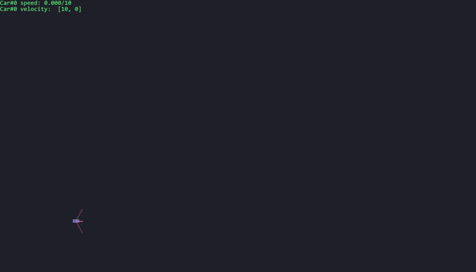

# pygame_car
Quick prototyping of car racing environment on pygame

### Key Mapping
KEY_UP | KEY_DOWN | KEY_LEFT | KEY_RIGHT | KEY_R |
--- | --- | --- | --- |--- |
Speed up (+0.3)| Slow down (+0.5) | Rotate (5°) | Rotate (-5°) | Reset to init()|

### Demo

### TODO LIST
- Add box2d collision
- Add multiplayer collison
- Add pre-defined maps (e.g. <a href="https://docs.aws.amazon.com/deepracer/latest/developerguide/deepracer-track-examples.html">AWS DeepRacer track</a>)
- Add game env template (`reset(), step(), render()`...)
- Add simple reward function
- Implement "more realistic" car control simulation
- Implement camera object on pygame
